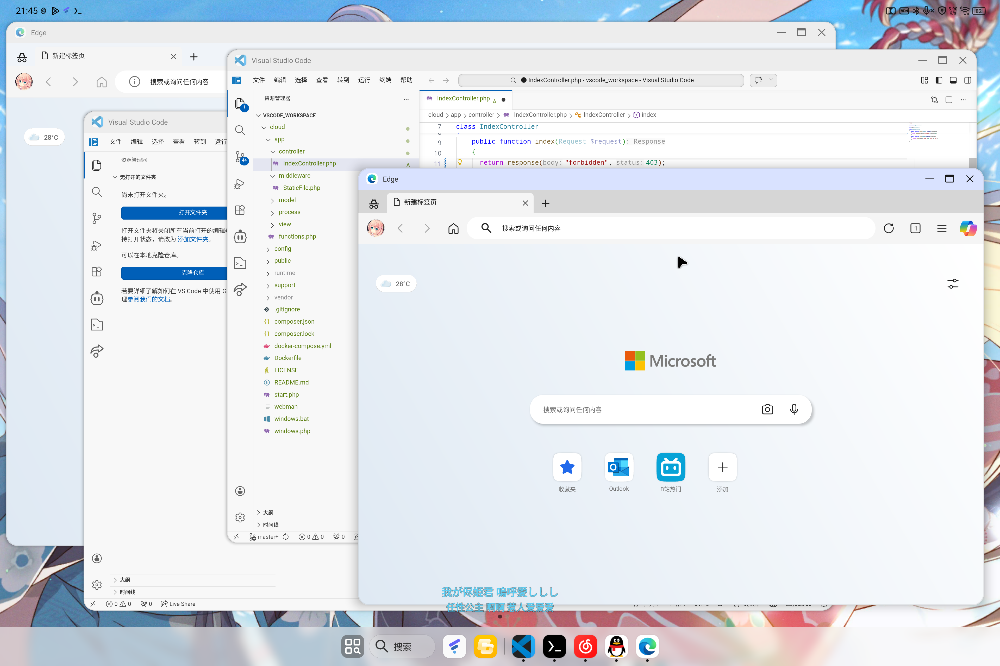

# code-server WebView Shell

[中文](README.md) | **English**

An Android WebView shell app that loads `https://localhost:8443/` (code-server) in fullscreen, turning your tablet or phone into a mobile IDE.



## Features

- **Fullscreen WebView**: No ActionBar, no status bar — maximum usable space
- **Multi-window**: Split-screen, freeform windows, independent taskbar instances
- **code-server New Window**: "New Window" menu item automatically opens a new app instance
- **External link interception**: Pop-ups and external domains redirect to the system browser
- **ESC key support**: System back button / hardware ESC forwarded to WebView (close panels / cancel completions)
- **Clipboard permission**: Auto-granted — copy/paste works inside code-server
- **File association**: External file managers can "Open with VS Code"
- **Self-signed certificates**: `localhost` HTTPS self-signed certs auto-trusted
- **VS Code icon**: Vector icon with transparent background, multi-density support

## Shortcuts

| Shortcut | Action |
|--------|------|
| Ctrl+Shift+W | Close current window |
| ESC / Back | Forward to WebView (close panel / dismiss suggestions) |

## Build

### Requirements

- JDK 17+
- Android SDK (API 24+, Build Tools 34+)

### Environment Variables

```powershell
# Windows PowerShell (adjust paths as needed)
$env:JAVA_HOME = "C:\Program Files\Android\Android Studio\jbr"
$env:ANDROID_HOME = "$env:LOCALAPPDATA\Android\Sdk"
```

```bash
# macOS / Linux
export JAVA_HOME=/Applications/Android\ Studio.app/Contents/jbr/Contents/Home
export ANDROID_HOME=$HOME/Library/Android/sdk
```

### Command

```bash
./gradlew assembleDebug
```

The APK is generated at `app/build/outputs/apk/debug/app-debug.apk`.

### First Build

The project includes the Gradle Wrapper — no manual Gradle install needed. Use `gradlew.bat` on Windows, `gradlew` on macOS/Linux.

### Prebuilt APK

GitHub Actions automatically builds the APK on every push to `master`/`main` or PR.

> CI uses a fixed signing key — new versions install over old ones without uninstalling.

## Configuration

### Change Target URL

Edit `app/src/main/java/localhost/webview/code/MainActivity.kt`:

```kotlin
companion object {
    private const val DEFAULT_URL = "https://localhost:8443/"
}
```

### Change App Name

Edit `app/src/main/res/values/strings.xml`:

```xml
<string name="app_name">Visual Studio Code</string>
```

### Change Icon

Replace `app/src/main/res/mipmap-*/ic_launcher.png` (5 densities). A 1024×1024 source image will be auto-scaled.

## Project Structure

```
├── app/
│   ├── build.gradle.kts          # Module build config (API 26+)
│   ├── proguard-rules.pro
│   └── src/main/
│       ├── AndroidManifest.xml
│       ├── java/localhost/webview/code/
│       │   └── MainActivity.kt   # Sole Activity
│       └── res/
│           ├── layout/activity_main.xml
│           ├── xml/network_security_config.xml
│           ├── drawable/          # Adaptive icon
│           ├── mipmap-*/          # Multi-density launcher icons
│           └── values/            # strings, colors, themes
├── build.gradle.kts              # Project-level build
├── settings.gradle.kts
├── gradle.properties
├── gradle/wrapper/
└── gradlew / gradlew.bat
```

## Termux Deployment

A companion one-click deployment script that runs code-server locally on Android, connecting directly to the WebView app.

```bash
curl -fsSLo install.sh https://touhou.diemoe.net/usr/termux/code-server/install.sh && bash install.sh
```

The script auto-installs dependencies, configures a `termux-services` service, and preloads extensions (Live Share / SSH FS / Chinese language pack).

Full docs: [scripts/README.md](scripts/README.md) ([English](scripts/README.en.md))

| Command | Action |
|------|------|
| `bash scripts/install.sh start` | Start service |
| `bash scripts/install.sh stop` | Stop service |
| `bash scripts/install.sh restart` | Restart service |
| `bash scripts/install.sh status` | View status |
| `bash scripts/install.sh enable` | Enable auto-start |

## License

MIT
